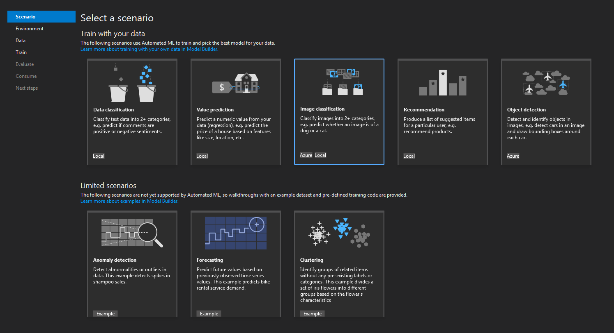
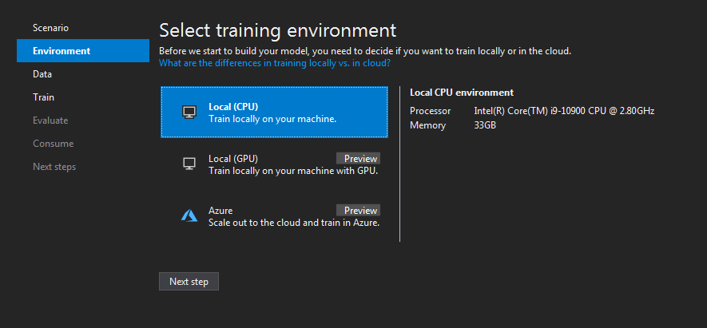
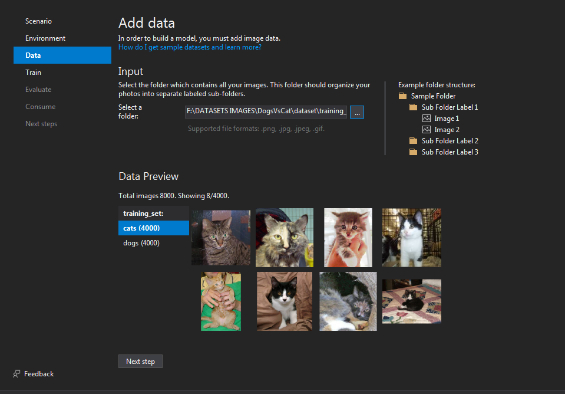
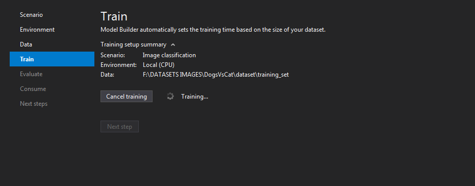
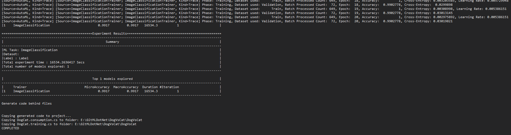
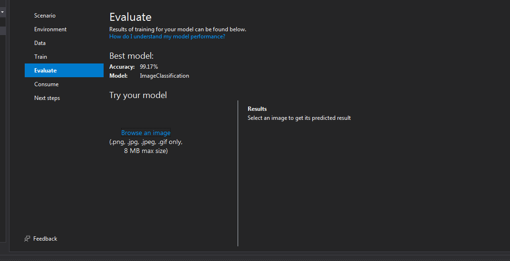
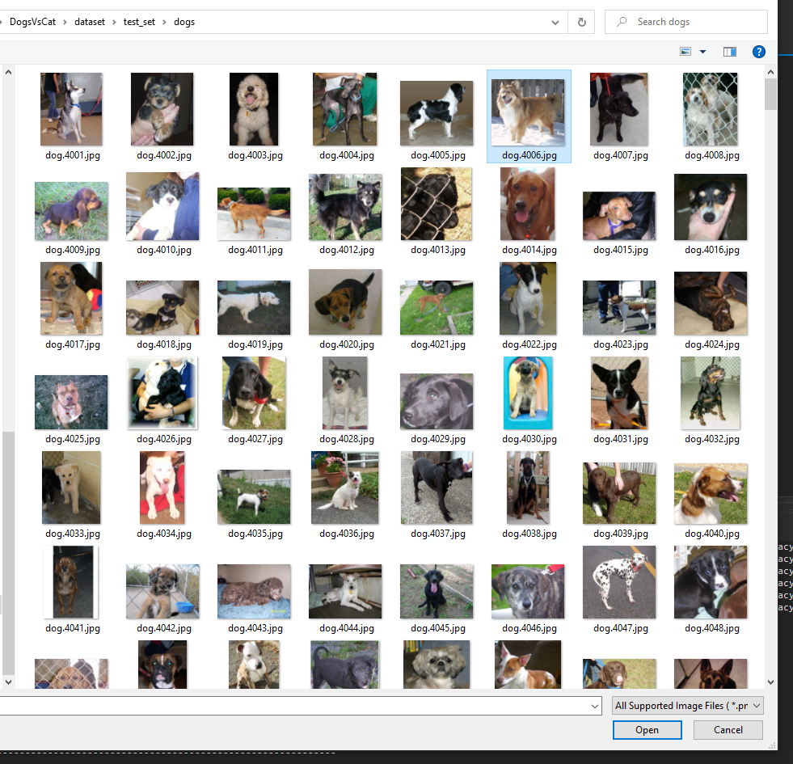
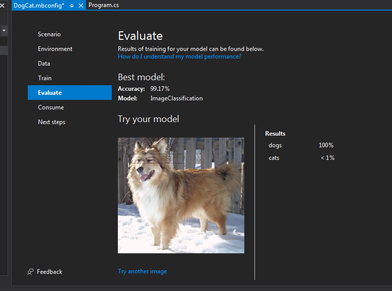
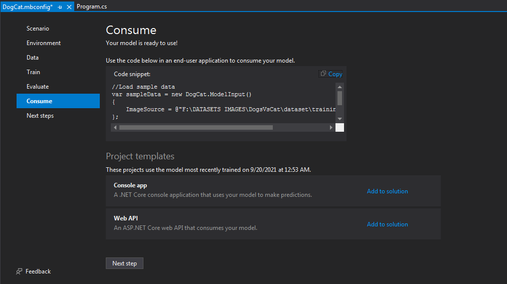
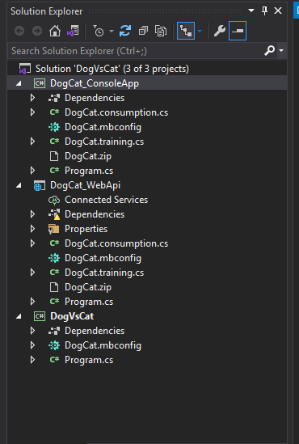

# ML.NET

---------------------------------------------------------
## ML.NET Model Builder is an intuitive graphical Visual Studio extension to build, train, and deploy custom machine learning models.
Model Builder uses automated machine learning (AutoML) to explore different machine learning algorithms and settings to help you find the one that best suits your scenario. 

## Select Image Classification Scenario
 
## Select Trainning Environment
 
## Once you have chosen your scenario, Model Builder asks you to provide a dataset
 
## Train
 
## In my case, this training lasted a little over 4 hours
 
## Evaluate
 
 
 
## Consume
 
## Add solution ConsoleApp and WebApi 
 

## OPEN PowerShell and Test your WebAPI 
> $body = @{ImageSource = "Image location on your local machine" 
> Invoke-RestMethod "https://localhost:'PORT'/predict" -Method Post -Body ($body | ConvertTo-Json) -ContentType "application/json" 

### DataSet: https://www.kaggle.com/muhammadshahzadkhan/dogvscat

# ML.NET Documentation
>https://docs.microsoft.com/en-us/dotnet/machine-learning/ 
>https://dotnet.microsoft.com/apps/machinelearning-ai/ml-dotnet/model-builder
